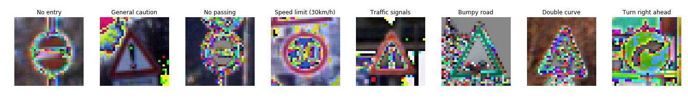

# Traffic Sign Recognition

The goals / steps of this project are the following:
* Load the data set (see below for links to the project data set)
* Explore, summarize and visualize the data set
* Design, train and test a model architecture
* Use the model to make predictions on new images
* Analyze the softmax probabilities of the new images
* Summarize the results with a written report

### Dataset

#### 1. dataset summary

Number of training examples = 34799
Number of validation examples = 4410
Number of testing examples = 12630
Image data shape = (32, 32, 3)
Number of classes = 34799
Number of unique labels = 43

##### 2. visualization of the dataset.

Distrubution of Labels

### Model

#### 1. the way to preprocess the image.

normalization

* why?:
  - to make training faster
  - it's standard technique for all machine learning tasks

* processed image:

It looks bad because images don't have scale like [0-255].

but no problem for neural network.

And at first, I had tried converting *rgb2gray*. But I couldn't make performance improve. So, I had stopped using *rgb2gray*

#### 2. final model architecture

I have used ELU for activation because It resolve the problem of Relu, dying neurons.

| Layer         		|     Description	        					|
|:---------------------:|:---------------------------------------------:|
| Input         		| 32x32x3 RGB image   							|
| Convolution 3x3     	| 1x1 stride, same padding, outputs 32x32x32 	|
| ELU					|												|
| Max pooling	      	| 2x2 stride,  outputs 16x16x32 				|
| Convolution 3x3     	| 1x1 stride, same padding, outputs 16x16x64 	|
| ELU					|												|
| Max pooling	      	| 2x2 stride,  outputs 8x8x64 				    |
| Convolution 3x3     	| 1x1 stride, same padding, outputs 8x8x64 	    |
| ELU					|												|
| Max pooling	      	| 2x2 stride,  outputs 4x4x64 				    |
| Fully connected		| outputs 512  									|
| Relu					|       										|
| Dropout        		| keep prob. = 0.5  							|
| Fully connected		| outputs 43  									|
| Softmax				|           									|
|						|												|

#### 3. Optimizer & Hyper Parameters

* optimizer: Adam
* the batch size: 64
* number of epochs: 50
* learning rate: 0.001

#### 4. the approach I have taken for finding a solution.

My final model results were:
* training set accuracy of 1.000
* validation set accuracy of 0.961
* validation set accuracy of 0.960

Iterative approach to get solution:
* first architecture was LeNet, which is explained in udacity lecture.
* first architecture was too small to utilize more labels and more complicated data distribution than mnist dataset.
* so, I added
  - the number of channels in convolutional layer
  - the number of nodes in fully connected layer
  - add dropout after first fully connected layer to avoid overfitting

* and changed
  - activation function from Relu to ELU, which can use negative input

### Test a Model on New Images

#### 1. get image of German traffic signs found on the web.

Here are five German traffic signs that I found on the web:

#### 2. model's predictions and accuracy on these new traffic signs

Here are the results of the predicted labels:

perfect! 100%

#### 3. prediction certainty

all model has 100% certainty.

the reason is ... test new images is too easy for classification???
